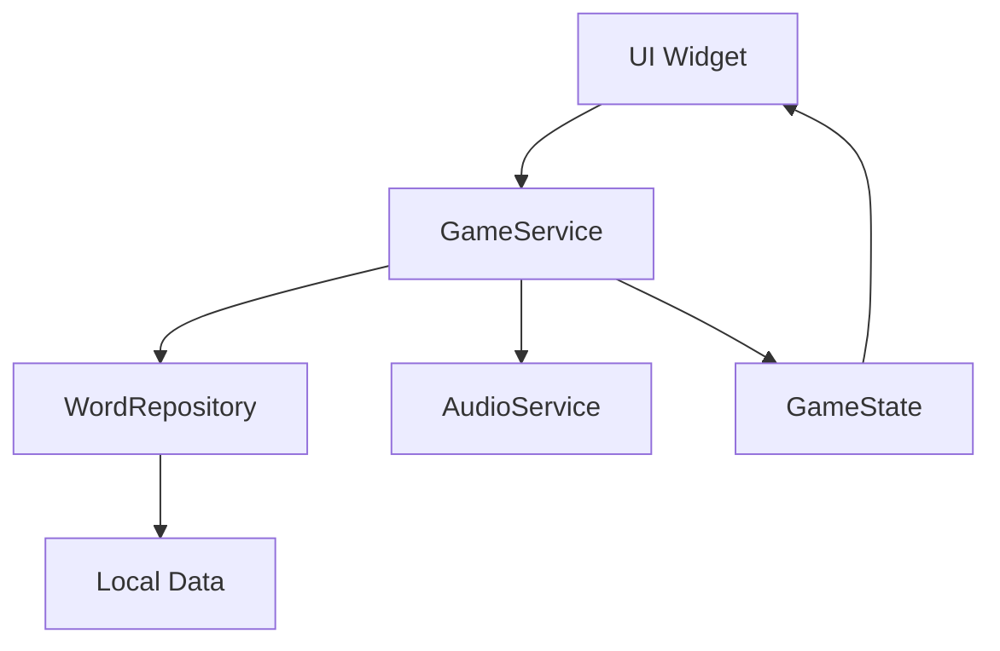

# WordRope - Guia de Desenvolvimento

## 📋 Índice
1. [Configuração do Ambiente](#configuração-do-ambiente)
2. [Arquitetura do Projeto](#arquitetura-do-projeto)
3. [Padrões de Código](#padrões-de-código)
4. [Gerenciamento de Estado](#gerenciamento-de-estado)
5. [Internacionalização](#internacionalização)
6. [Sistema de Áudio](#sistema-de-áudio)
7. [Testes](#testes)
8. [Build e Deploy](#build-e-deploy)
9. [Troubleshooting](#troubleshooting)

---

## 🛠️ Configuração do Ambiente

### Requisitos do Sistema

#### Windows
```bash
# Instalar Flutter
git clone https://github.com/flutter/flutter.git -b stable
export PATH="$PATH:`pwd`/flutter/bin"

# Verificar instalação
flutter doctor
```

#### macOS
```bash
# Usando Homebrew
brew install flutter

# Ou download direto
curl -O https://storage.googleapis.com/flutter_infra_release/releases/stable/macos/flutter_macos_3.24.5-stable.zip
unzip flutter_macos_3.24.5-stable.zip
export PATH="$PATH:`pwd`/flutter/bin"
```

#### Linux
```bash
# Download e extração
wget https://storage.googleapis.com/flutter_infra_release/releases/stable/linux/flutter_linux_3.24.5-stable.tar.xz
tar xf flutter_linux_3.24.5-stable.tar.xz
export PATH="$PATH:`pwd`/flutter/bin"
```

### IDEs Recomendadas

#### Visual Studio Code
```json
// .vscode/settings.json
{
  "dart.flutterSdkPath": "/path/to/flutter",
  "dart.lineLength": 80,
  "dart.insertArgumentPlaceholders": false,
  "editor.rulers": [80],
  "editor.formatOnSave": true
}
```

#### Android Studio
- Plugin Flutter
- Plugin Dart
- Configuração de emuladores Android

### Configuração do Projeto

```bash
# Clone do repositório
git clone https://github.com/wordrope/wordrope.git
cd wordrope

# Instalação de dependências
flutter pub get

# Geração de arquivos de localização
flutter gen-l10n

# Verificação da configuração
flutter doctor
flutter devices
```

---

## 🏗️ Arquitetura do Projeto

### Padrão Arquitetural

O WordRope utiliza uma arquitetura em camadas baseada no padrão **Provider + Repository**:

```
┌─────────────────┐
│   Presentation  │ ← Pages, Widgets
├─────────────────┤
│    Business     │ ← Services, Providers
├─────────────────┤
│      Data       │ ← Repositories, Models
└─────────────────┘
```

### Estrutura de Pastas Detalhada

```
lib/
├── data/                    # Camada de dados
│   └── word_repository.dart # Repositório de palavras
├── localization/            # Arquivos de internacionalização
│   ├── app_pt.arb          # Português
│   ├── app_en.arb          # Inglês
│   └── ...                 # Outros idiomas
├── models/                  # Modelos de dados
│   ├── category.dart       # Modelo de categoria
│   ├── game_state.dart     # Estado do jogo
│   └── word.dart           # Modelo de palavra
├── pages/                   # Telas da aplicação
│   ├── game_page.dart      # Tela principal do jogo
│   └── home_page.dart      # Tela inicial
├── services/                # Serviços de negócio
│   ├── audio_service.dart  # Gerenciamento de áudio
│   └── game_service.dart   # Lógica do jogo
├── utils/                   # Utilitários
│   └── app_theme.dart      # Tema da aplicação
├── widgets/                 # Componentes reutilizáveis
│   ├── category_card.dart  # Card de categoria
│   ├── game_result_dialog.dart # Diálogo de resultado
│   ├── hangman_drawing.dart # Desenho da forca
│   ├── virtual_keyboard.dart # Teclado virtual
│   └── word_display.dart   # Exibição da palavra
└── main.dart               # Ponto de entrada
```

### Fluxo de Dados



---

## 📝 Padrões de Código

### Convenções de Nomenclatura

```dart
// Classes: PascalCase
class GameService extends ChangeNotifier {}

// Variáveis e métodos: camelCase
String currentWord = '';
void startNewGame() {}

// Constantes: SCREAMING_SNAKE_CASE
static const int MAX_WRONG_GUESSES = 6;

// Arquivos: snake_case
game_service.dart
word_repository.dart
```

### Estrutura de Classes

```dart
/// Documentação da classe
/// 
/// Exemplo de uso:
/// ```dart
/// final service = GameService();
/// service.startNewGame(category);
/// ```
class GameService extends ChangeNotifier {
  // Variáveis privadas primeiro
  GameState? _gameState;
  String _currentLanguage = 'pt';
  
  // Getters públicos
  GameState? get gameState => _gameState;
  String get currentLanguage => _currentLanguage;
  
  // Métodos públicos
  void startNewGame(Category category) {
    // Implementação
  }
  
  // Métodos privados por último
  Word? _getRandomWord(Category category) {
    // Implementação
  }
}
```

### Tratamento de Erros

```dart
// Uso de try-catch para operações que podem falhar
Future<void> playSound() async {
  try {
    await _audioPlayer.play(AssetSource('sounds/correct.mp3'));
  } catch (e) {
    if (kDebugMode) {
      print('Erro ao reproduzir som: $e');
    }
  }
}

// Validação de parâmetros
void guessLetter(String letter) {
  assert(letter.isNotEmpty, 'Letra não pode ser vazia');
  assert(letter.length == 1, 'Deve ser apenas uma letra');
  
  if (_gameState == null) {
    throw StateError('Jogo não foi iniciado');
  }
  
  // Lógica do método
}
```

---

## 🔄 Gerenciamento de Estado

### Provider Pattern

O WordRope utiliza o padrão Provider para gerenciamento de estado:

```dart
// main.dart - Configuração do Provider
void main() {
  runApp(
    ChangeNotifierProvider(
      create: (context) => GameService(),
      child: const WordRopeApp(),
    ),
  );
}

// Consumindo o estado em widgets
class GamePage extends StatelessWidget {
  @override
  Widget build(BuildContext context) {
    return Consumer<GameService>(
      builder: (context, gameService, child) {
        final gameState = gameService.gameState;
        
        if (gameState == null) {
          return const CircularProgressIndicator();
        }
        
        return Column(
          children: [
            WordDisplay(gameState: gameState),
            VirtualKeyboard(
              onLetterPressed: gameService.guessLetter,
            ),
          ],
        );
      },
    );
  }
}
```

### Estado Imutável

```dart
// GameState é imutável - sempre retorna nova instância
class GameState {
  final Word currentWord;
  final Set<String> guessedLetters;
  final int wrongGuessCount;
  final GameStatus status;
  
  const GameState({
    required this.currentWord,
    this.guessedLetters = const {},
    this.wrongGuessCount = 0,
    this.status = GameStatus.playing,
  });
  
  // Método copyWith para criar novas instâncias
  GameState copyWith({
    Word? currentWord,
    Set<String>? guessedLetters,
    int? wrongGuessCount,
    GameStatus? status,
  }) {
    return GameState(
      currentWord: currentWord ?? this.currentWord,
      guessedLetters: guessedLetters ?? this.guessedLetters,
      wrongGuessCount: wrongGuessCount ?? this.wrongGuessCount,
      status: status ?? this.status,
    );
  }
  
  // Método para processar tentativa de letra
  GameState guessLetter(String letter) {
    if (isLetterGuessed(letter) || status != GameStatus.playing) {
      return this;
    }
    
    final newGuessedLetters = Set<String>.from(guessedLetters)..add(letter);
    final isCorrect = currentWord.text.toUpperCase().contains(letter.toUpperCase());
    final newWrongCount = isCorrect ? wrongGuessCount : wrongGuessCount + 1;
    
    // Verificar status do jogo
    GameStatus newStatus = GameStatus.playing;
    if (newWrongCount >= 6) {
      newStatus = GameStatus.lost;
    } else if (currentWord.isCompletelyGuessed(newGuessedLetters)) {
      newStatus = GameStatus.won;
    }
    
    return copyWith(
      guessedLetters: newGuessedLetters,
      wrongGuessCount: newWrongCount,
      status: newStatus,
    );
  }
}
```

---

## 🌍 Internacionalização

### Configuração

```yaml
# pubspec.yaml
dependencies:
  flutter:
    sdk: flutter
  flutter_localizations:
    sdk: flutter
  intl: ^0.19.0

flutter:
  generate: true
```

```yaml
# l10n.yaml
arb-dir: lib/localization
template-arb-file: app_pt.arb
output-localization-file: app_localizations.dart
output-class: AppLocalizations
```

### Estrutura dos Arquivos ARB

```json
// lib/localization/app_pt.arb
{
  "@@locale": "pt",
  "appTitle": "WordRope",
  "@appTitle": {
    "description": "Título da aplicação"
  },
  "remainingAttempts": "Tentativas restantes: {count}",
  "@remainingAttempts": {
    "description": "Tentativas restantes",
    "placeholders": {
      "count": {
        "type": "int"
      }
    }
  }
}
```

### Uso nas Widgets

```dart
// Importação
import 'package:flutter_gen/gen_l10n/app_localizations.dart';

// Uso em widgets
class HomePage extends StatelessWidget {
  @override
  Widget build(BuildContext context) {
    final l10n = AppLocalizations.of(context)!;
    
    return Scaffold(
      appBar: AppBar(
        title: Text(l10n.appTitle),
      ),
      body: Column(
        children: [
          Text(l10n.chooseCategory),
          Text(l10n.remainingAttempts(gameState.remainingGuesses)),
        ],
      ),
    );
  }
}
```

### Adicionando Novos Idiomas

1. **Criar arquivo ARB**
   ```bash
   cp lib/localization/app_pt.arb lib/localization/app_fr.arb
   ```

2. **Traduzir conteúdo**
   ```json
   {
     "@@locale": "fr",
     "appTitle": "WordRope",
     "chooseCategory": "Choisissez une catégorie"
   }
   ```

3. **Atualizar WordRepository**
   ```dart
   static final Map<String, Map<String, List<String>>> _wordsData = {
     'pt': { /* palavras em português */ },
     'en': { /* palavras em inglês */ },
     'fr': { /* palavras em francês */ },
   };
   ```

4. **Regenerar localizações**
   ```bash
   flutter gen-l10n
   ```

---

## 🔊 Sistema de Áudio

### Arquitetura do AudioService

```dart
class AudioService {
  static final AudioService _instance = AudioService._internal();
  factory AudioService() => _instance;
  AudioService._internal();

  final AudioPlayer _audioPlayer = AudioPlayer();
  bool _soundEnabled = true;

  // Singleton pattern para garantir uma única instância
  
  Future<void> playCorrectSound() async {
    if (!_soundEnabled) return;
    
    try {
      await _audioPlayer.play(AssetSource('sounds/correct.mp3'));
    } catch (e) {
      _handleAudioError('correct sound', e);
    }
  }
  
  void _handleAudioError(String soundType, dynamic error) {
    if (kDebugMode) {
      print('Erro ao reproduzir $soundType: $error');
    }
    // Aqui poderia implementar fallback ou logging
  }
}
```

### Integração com GameService

```dart
class GameService extends ChangeNotifier {
  final AudioService _audioService = AudioService();
  
  bool guessLetter(String letter) {
    // ... lógica do jogo
    
    // Reproduzir som baseado no resultado
    if (wasWrong) {
      _audioService.playWrongSound();
    } else {
      _audioService.playCorrectSound();
    }
    
    // Verificar fim de jogo
    if (gameEnded) {
      Future.delayed(const Duration(milliseconds: 500), () {
        if (gameWon) {
          _audioService.playVictorySound();
        } else {
          _audioService.playDefeatSound();
        }
      });
    }
    
    return wasWrong;
  }
}
```

---

## 🧪 Testes

### Estrutura de Testes

```
test/
├── models/
│   ├── category_test.dart
│   ├── game_state_test.dart
│   └── word_test.dart
├── services/
│   ├── audio_service_test.dart
│   └── game_service_test.dart
├── widgets/
│   ├── category_card_test.dart
│   ├── virtual_keyboard_test.dart
│   └── word_display_test.dart
└── widget_test.dart
```

### Testes Unitários

```dart
// test/models/game_state_test.dart
import 'package:flutter_test/flutter_test.dart';
import 'package:wordrope/models/game_state.dart';
import 'package:wordrope/models/word.dart';

void main() {
  group('GameState', () {
    late Word testWord;
    late GameState gameState;
    
    setUp(() {
      testWord = Word(text: 'FLUTTER', hint: 'Framework');
      gameState = GameState(currentWord: testWord);
    });
    
    test('should start with empty guessed letters', () {
      expect(gameState.guessedLetters, isEmpty);
      expect(gameState.wrongGuessCount, 0);
      expect(gameState.status, GameStatus.playing);
    });
    
    test('should add correct letter to guessed letters', () {
      final newState = gameState.guessLetter('F');
      
      expect(newState.guessedLetters, contains('F'));
      expect(newState.wrongGuessCount, 0);
      expect(newState.status, GameStatus.playing);
    });
    
    test('should increment wrong count for incorrect letter', () {
      final newState = gameState.guessLetter('X');
      
      expect(newState.guessedLetters, contains('X'));
      expect(newState.wrongGuessCount, 1);
      expect(newState.status, GameStatus.playing);
    });
    
    test('should win when all letters are guessed', () {
      GameState state = gameState;
      
      // Adivinhar todas as letras da palavra FLUTTER
      for (final letter in ['F', 'L', 'U', 'T', 'E', 'R']) {
        state = state.guessLetter(letter);
      }
      
      expect(state.status, GameStatus.won);
    });
    
    test('should lose after 6 wrong guesses', () {
      GameState state = gameState;
      
      // Fazer 6 tentativas erradas
      for (final letter in ['A', 'B', 'C', 'D', 'G', 'H']) {
        state = state.guessLetter(letter);
      }
      
      expect(state.wrongGuessCount, 6);
      expect(state.status, GameStatus.lost);
    });
  });
}
```

### Testes de Widget

```dart
// test/widgets/virtual_keyboard_test.dart
import 'package:flutter/material.dart';
import 'package:flutter_test/flutter_test.dart';
import 'package:wordrope/widgets/virtual_keyboard.dart';

void main() {
  group('VirtualKeyboard', () {
    testWidgets('should display all letters', (WidgetTester tester) async {
      await tester.pumpWidget(
        MaterialApp(
          home: Scaffold(
            body: VirtualKeyboard(
              onLetterPressed: (letter) {},
              usedLetters: const {},
            ),
          ),
        ),
      );
      
      // Verificar se todas as letras estão presentes
      for (int i = 65; i <= 90; i++) {
        final letter = String.fromCharCode(i);
        expect(find.text(letter), findsOneWidget);
      }
    });
    
    testWidgets('should call callback when letter is pressed', (WidgetTester tester) async {
      String? pressedLetter;
      
      await tester.pumpWidget(
        MaterialApp(
          home: Scaffold(
            body: VirtualKeyboard(
              onLetterPressed: (letter) {
                pressedLetter = letter;
              },
              usedLetters: const {},
            ),
          ),
        ),
      );
      
      // Tocar na letra A
      await tester.tap(find.text('A'));
      await tester.pump();
      
      expect(pressedLetter, 'A');
    });
    
    testWidgets('should disable used letters', (WidgetTester tester) async {
      await tester.pumpWidget(
        MaterialApp(
          home: Scaffold(
            body: VirtualKeyboard(
              onLetterPressed: (letter) {},
              usedLetters: const {'A', 'B'},
            ),
          ),
        ),
      );
      
      // Verificar se as letras usadas estão desabilitadas
      final buttonA = tester.widget<ElevatedButton>(
        find.ancestor(
          of: find.text('A'),
          matching: find.byType(ElevatedButton),
        ),
      );
      
      expect(buttonA.onPressed, isNull);
    });
  });
}
```

### Executando Testes

```bash
# Todos os testes
flutter test

# Testes específicos
flutter test test/models/
flutter test test/services/game_service_test.dart

# Com cobertura
flutter test --coverage
genhtml coverage/lcov.info -o coverage/html
open coverage/html/index.html
```

---

## 🚀 Build e Deploy

### Configuração de Ambientes

```dart
// lib/config/app_config.dart
class AppConfig {
  static const String appName = 'WordRope';
  static const String version = '1.0.0';
  
  // Configurações por ambiente
  static bool get isProduction => const bool.fromEnvironment('PRODUCTION');
  static bool get enableAnalytics => isProduction;
  static bool get enableCrashlytics => isProduction;
  
  // URLs da API (se necessário no futuro)
  static String get baseUrl {
    if (isProduction) {
      return 'https://api.wordrope.com';
    }
    return 'https://api-dev.wordrope.com';
  }
}
```

### Scripts de Build

```bash
#!/bin/bash
# scripts/build_android.sh

echo "🔨 Building Android APK..."

# Limpar build anterior
flutter clean
flutter pub get

# Build de produção
flutter build apk --release --dart-define=PRODUCTION=true

# Verificar se o build foi bem-sucedido
if [ $? -eq 0 ]; then
    echo "✅ Android APK built successfully!"
    echo "📁 Location: build/app/outputs/flutter-apk/app-release.apk"
else
    echo "❌ Android build failed!"
    exit 1
fi
```

```bash
#!/bin/bash
# scripts/build_web.sh

echo "🌐 Building Web version..."

# Limpar build anterior
flutter clean
flutter pub get

# Build para web
flutter build web --release --dart-define=PRODUCTION=true

# Otimizações adicionais
echo "🗜️ Compressing assets..."
gzip -9 -k build/web/main.dart.js
gzip -9 -k build/web/flutter_service_worker.js

echo "✅ Web build completed!"
echo "📁 Location: build/web/"
```

### CI/CD com GitHub Actions

```yaml
# .github/workflows/build.yml
name: Build and Test

on:
  push:
    branches: [ main, develop ]
  pull_request:
    branches: [ main ]

jobs:
  test:
    runs-on: ubuntu-latest
    steps:
    - uses: actions/checkout@v3
    
    - name: Setup Flutter
      uses: subosito/flutter-action@v2
      with:
        flutter-version: '3.24.5'
        
    - name: Install dependencies
      run: flutter pub get
      
    - name: Run tests
      run: flutter test --coverage
      
    - name: Upload coverage
      uses: codecov/codecov-action@v3
      with:
        file: coverage/lcov.info

  build-android:
    needs: test
    runs-on: ubuntu-latest
    steps:
    - uses: actions/checkout@v3
    
    - name: Setup Flutter
      uses: subosito/flutter-action@v2
      with:
        flutter-version: '3.24.5'
        
    - name: Build APK
      run: |
        flutter pub get
        flutter build apk --release
        
    - name: Upload APK
      uses: actions/upload-artifact@v3
      with:
        name: app-release.apk
        path: build/app/outputs/flutter-apk/app-release.apk

  build-web:
    needs: test
    runs-on: ubuntu-latest
    steps:
    - uses: actions/checkout@v3
    
    - name: Setup Flutter
      uses: subosito/flutter-action@v2
      with:
        flutter-version: '3.24.5'
        
    - name: Build Web
      run: |
        flutter pub get
        flutter build web --release
        
    - name: Deploy to GitHub Pages
      uses: peaceiris/actions-gh-pages@v3
      if: github.ref == 'refs/heads/main'
      with:
        github_token: ${{ secrets.GITHUB_TOKEN }}
        publish_dir: ./build/web
```

---

## 🔧 Troubleshooting

### Problemas Comuns

#### 1. Erro de Localização
```
Error: Could not find generated file app_localizations.dart
```

**Solução:**
```bash
flutter gen-l10n
flutter pub get
```

#### 2. Erro de Áudio no Web
```
AudioPlayer error: NotSupportedError
```

**Solução:**
```dart
// Verificar suporte a áudio na web
if (kIsWeb) {
  // Usar fallback ou desabilitar áudio
  return;
}
```

#### 3. Problemas de Performance
```
Jank detected: Frame took 16ms+ to render
```

**Solução:**
```dart
// Usar const constructors
const Text('Hello World')

// Evitar rebuilds desnecessários
Consumer<GameService>(
  builder: (context, gameService, child) {
    return ExpensiveWidget(
      data: gameService.data,
      child: child, // Widget que não muda
    );
  },
  child: const StaticWidget(),
)
```

### Debugging

#### Flutter Inspector
```bash
# Executar com inspector
flutter run --debug
```

#### Logs Detalhados
```dart
// Adicionar logs para debugging
import 'dart:developer' as developer;

void debugLog(String message) {
  if (kDebugMode) {
    developer.log(message, name: 'WordRope');
  }
}
```

#### Performance Profiling
```bash
# Profile de performance
flutter run --profile
flutter run --release --profile
```

---

## 📚 Recursos Adicionais

### Documentação Oficial
- [Flutter Documentation](https://docs.flutter.dev/)
- [Dart Language Tour](https://dart.dev/guides/language/language-tour)
- [Provider Package](https://pub.dev/packages/provider)

### Ferramentas Úteis
- [Flutter Inspector](https://docs.flutter.dev/development/tools/flutter-inspector)
- [Dart DevTools](https://dart.dev/tools/dart-devtools)
- [Flutter Performance](https://docs.flutter.dev/perf)

### Comunidade
- [Flutter Community](https://flutter.dev/community)
- [Stack Overflow](https://stackoverflow.com/questions/tagged/flutter)
- [Reddit r/FlutterDev](https://www.reddit.com/r/FlutterDev/)

---

*Última atualização: Dezembro 2024*
*Versão: 1.0.0*

